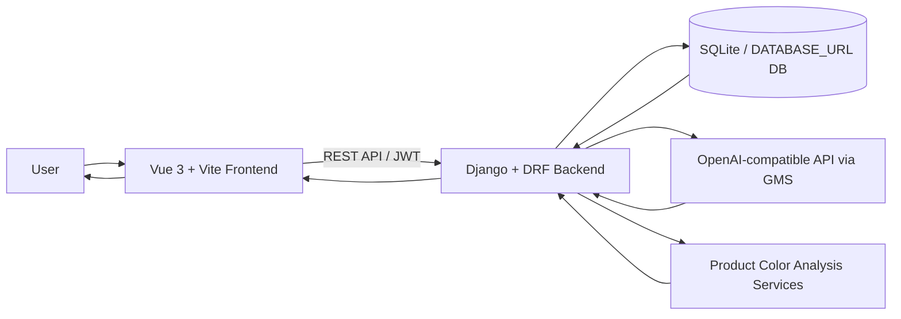
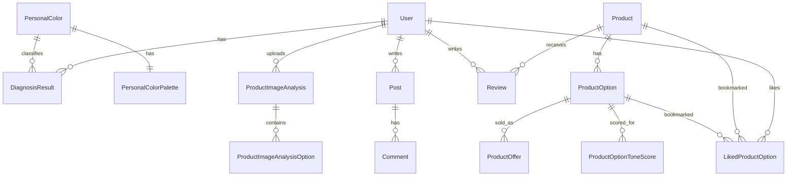

<div align="center">


### AI 기반 퍼스널 컬러 진단 및 화장품 추천 서비스

**나만의 분위기를 찾는 가장 똑똑한 방법**

</div>
### AI 기반 퍼스널 컬러 진단 및 화장품 추천 서비스

**나만의 분위기를 찾는 가장 똑똑한 방법**

</div>

---

## 목차

1. [Project Overview](#project-overview)
2. [Key Features](#key-features)
3. [Screenshots / Demo](#screenshots--demo)
4. [Tech Stack](#tech-stack)
5. [System Architecture](#system-architecture)
6. [AI Pipeline](#ai-pipeline)
7. [Recommendation System](#recommendation-system)
8. [Database / Data Model](#database--data-model)
9. [How to Run](#how-to-run)
10. [Troubleshooting](#troubleshooting)
11. [Project Structure](#project-structure)
12. [Team / Role](#team--role)
13. [Results / Learning Points](#results--learning-points)
14. [Future Work](#future-work)
15. [License / Notes](#license--notes)

---

## Project Overview

Lumière는 얼굴 이미지 기반 퍼스널 컬러 진단 결과를 실제 화장품 선택까지 연결하는 뷰티 추천 서비스입니다.

퍼스널 컬러 진단만으로는 사용자가 어떤 브랜드의 어떤 옵션을 골라야 하는지 판단하기 어렵습니다. Lumière는 진단 결과, 제품 옵션 색상, 사용자 선호, 북마크/리뷰 신호를 함께 활용해 개인에게 맞는 화장품 옵션과 추천 이유를 제공합니다.

### Main Flow

```text
회원가입/로그인
→ 얼굴 이미지 기반 퍼스널 컬러 진단
→ AI 메이크업 프리뷰
→ 상품 이미지/옵션 색상 분석
→ 오늘의 추천 및 AI's Pick 설명
→ 커뮤니티/마이페이지에서 기록 관리
```

---

## Key Features

| 기능 | 설명 |
|---|---|
| AI 퍼스널 컬러 진단 | 얼굴 이미지를 분석해 `tone_key`, 신뢰도, 피부 톤 축 정보를 생성합니다. |
| GenAI 메이크업 프리뷰 | 진단 결과와 고정 팔레트 데이터를 바탕으로 메이크업 스타일 이미지를 생성합니다. |
| 화장품 색상 분석 | 상품 이미지에서 옵션 색상과 HEX 값을 추출하고, 사용자 톤과의 매칭 점수를 계산합니다. |
| 옵션 단위 추천 | 상품 단위가 아니라 실제 구매 옵션 단위로 색상 적합도를 비교합니다. |
| Today’s Recommendation | 카테고리 균형을 고려해 개인화 추천 상품을 제공합니다. |
| AI’s Pick 설명 | 추천 결과를 뷰티 문장으로 풀어 사용자가 이유를 이해할 수 있게 합니다. |
| 퍼스널 컬러 라운지 | 톤별 커뮤니티, 게시글, 댓글, 좋아요 기능을 제공합니다. |
| MyPage | 진단 결과, 관심 옵션, 상품 분석 기록, 작성 글을 관리합니다. |

> 상품 URL 분석 파이프라인은 백엔드 서비스 계층에 구현되어 있으나, 현재 실행 가능한 프론트 연결은 이미지 기반 상품 분석 중심입니다.

---

## Screenshots / Demo

실제 스크린샷이 준비되면 아래 경로의 이미지를 교체합니다.

| 화면 | Preview |
|---|---|
| Home |  |
| Personal Color Diagnosis |  |
| Diagnosis Result |  |
| Product Analysis |  |
| Today’s Recommendation |  |
| Community |  |
| MyPage |  |

---

## Tech Stack

| Area | Stack |
|---|---|
| Frontend | Vue 3, Vite, JavaScript, CSS, Pinia, Vue Router, Axios |
| Backend | Python 3.13.5, Django 5.2.4, Django REST Framework, Simple JWT |
| Database | SQLite for local development, `DATABASE_URL` 기반 PostgreSQL 호환 설정 |
| AI | OpenAI-compatible API via GMS, Vision analysis, GenAI image generation |
| Deployment | Cloudflare Workers/Pages static assets, Wrangler, Django backend tunnel/ngrok 또는 별도 서버 |
| Tools | Git, GitHub/GitLab, Whitenoise, Gunicorn/Uvicorn |

---

## System Architecture



### Request Flow

```text
사용자 업로드/요청
→ Vue 화면 및 API service
→ Django REST API
→ AI 진단/상품 분석/추천 서비스
→ DB 저장 및 조회
→ API 응답
→ UI 렌더링
```

---

## AI Pipeline

### Personal Color Diagnosis

1. 사용자가 얼굴 이미지를 업로드합니다.
2. 백엔드가 이미지를 AI 요청에 맞게 처리합니다.
3. OpenAI-compatible Vision API가 톤 키, 신뢰도, 피부 특성 값을 반환합니다.
4. `PersonalColorPalette` 마스터 데이터와 결합해 팔레트, 메이크업 가이드, 스타일 정보를 구성합니다.
5. `DiagnosisResult`에 저장하고 사용자의 대표 진단 결과로 활용합니다.

### Product Image Color Analysis

1. 사용자가 상품 컬러 차트 이미지를 업로드합니다.
2. AI Vision이 상품명, 브랜드명, 옵션명을 추정합니다.
3. 이미지에서 컬러 후보와 HEX 값을 추출합니다.
4. 사용자의 대표 퍼스널 컬러가 있으면 옵션별 `match_score`를 계산합니다.
5. 사용자가 옵션명/색상값을 검수하고 확정할 수 있습니다.

### Recommendation Pipeline

1. 대표 진단 결과 또는 query parameter의 `tone_key`로 사용자 톤 프로필을 구성합니다.
2. 상품 옵션의 색상 속성값과 사용자 톤 축을 비교합니다.
3. 옵션별 `match_score`와 등급을 계산합니다.
4. 카테고리 균형을 맞춰 추천 목록을 구성합니다.
5. AI’s Pick 문구로 추천 이유를 설명합니다.

---

## Recommendation System

현재 추천 정렬은 안정성을 위해 옵션 색상 매칭 기반 `match_score`를 중심으로 동작합니다.

응답에는 하이브리드 점수도 함께 포함됩니다.

| Score Field | Weight | 의미 |
|---|---:|---|
| `personal_color_score` | 45% | 사용자 퍼스널 컬러와 옵션 색상 매칭 |
| `preference_score` | 20% | 사용자의 좋아요/관심 옵션 패턴 |
| `similar_user_score` | 20% | 같은 톤 사용자의 북마크 신호 |
| `review_bookmark_score` | 15% | 리뷰 평점, 리뷰 수, 북마크 신호 |

`hybrid_score_sources.ranking` 값은 현재 `match_score`로 설정되어 있어, 실제 정렬 기준은 기존 매칭 점수 기반임을 명확히 보여줍니다.

AI’s Pick은 단순 점수 대신 다음과 같은 뷰티 문장으로 추천 이유를 제공합니다.

```text
"04 로즈 베이지는 여름 쿨 뮤트에 매일 쓰기 좋은 컬러예요.
차분한 로즈빛과 부드러운 혈색감으로 데일리 립 포인트를 만들기 좋아요."
```

---

## Database / Data Model



| Model | 역할 |
|---|---|
| `User` | 회원, 닉네임, 프로필 이미지, soft delete 관리 |
| `DiagnosisResult` | 퍼스널 컬러 진단 결과, 대표 진단, AI 응답, 메이크업 생성 상태 저장 |
| `PersonalColorPalette` | 톤별 고정 팔레트, 메이크업 가이드, 스타일 키워드 저장 |
| `Product` | 브랜드, 상품명, 카테고리, 대표 이미지, 기본 상품 정보 |
| `ProductOption` | 옵션명, HEX/RGB, 명도/채도/쿨웜/깊이 등 색상 속성 |
| `ProductOffer` | 옵션별 판매처, 가격, 상품 URL |
| `ProductOptionToneScore` | 옵션과 퍼스널 컬러 톤 사이의 매칭 점수 |
| `Review` | 상품 리뷰와 평점 |
| `LikedProductOption` | 사용자 관심 상품/옵션 |
| `ProductImageAnalysis` | 업로드 기반 상품 이미지 분석 기록 |
| `ProductImageAnalysisOption` | 분석된 옵션 색상, 점수, 검수 상태 |
| `Post`, `Comment` | 커뮤니티 게시글과 댓글 |

---

## How to Run

### 1. Backend Setup

```bash
cd Lumiere/back
python -m venv .venv
```

Windows PowerShell:

```powershell
.\.venv\Scripts\Activate.ps1
```

macOS / Linux:

```bash
source .venv/bin/activate
```

Install dependencies:

```bash
python -m pip install -r requirements.txt
```

Create `Lumiere/back/.env`:

```env
SECRET_KEY=change-me
DEBUG=True
ALLOWED_HOSTS=localhost,127.0.0.1
CORS_ALLOWED_ORIGINS=http://localhost:5173,http://127.0.0.1:5173
CSRF_TRUSTED_ORIGINS=http://localhost:5173,http://127.0.0.1:5173
BACKEND_ORIGIN=http://127.0.0.1:8000

OPENAI_API_KEY=your-gms-or-openai-compatible-key
OPENAI_BASE_URL=https://gms.ssafy.io/gmsapi/api.openai.com/v1
OPENAI_MODEL=gpt-4.1
AI_DIAGNOSIS_MODEL=gpt-4.1
PRODUCT_IMAGE_ANALYSIS_MODEL=gpt-4.1
OPENAI_DIAGNOSIS_FALLBACK_ON_ERROR=True
PRODUCT_IMAGE_ANALYSIS_ENABLE_AI=True
```

AI 키 없이 로컬 화면 흐름만 확인하려면 다음 값을 사용할 수 있습니다.

```env
OPENAI_DIAGNOSIS_MOCK=True
OPENAI_IMAGE_GENERATION_MOCK=True
PRODUCT_IMAGE_ANALYSIS_ENABLE_AI=False
```

Initialize database:

```bash
python manage.py migrate
python manage.py seed_personal_color_palettes
python manage.py seed_product_catalog --commit
```

Run backend:

```bash
python manage.py runserver
```

Backend URL:

```text
http://127.0.0.1:8000
```

### 2. Frontend Setup

```bash
cd Lumiere/front/lumiere-frontend
npm install
```

Create `Lumiere/front/lumiere-frontend/.env`:

```env
VITE_API_BASE_URL=http://127.0.0.1:8000
```

Run frontend:

```bash
npm run dev
```

Frontend URL:

```text
http://localhost:5173
```

### 3. Build / Preview

```bash
cd Lumiere/front/lumiere-frontend
npm run build
npm run preview
```

### 4. Cloudflare Deploy

`wrangler.toml`은 `./dist`를 Cloudflare static assets로 배포하도록 설정되어 있습니다.

```bash
cd Lumiere/front/lumiere-frontend
npm run build
npx wrangler deploy
```

운영 배포 시에는 `VITE_API_BASE_URL`, Django `ALLOWED_HOSTS`, `CORS_ALLOWED_ORIGINS`, `CSRF_TRUSTED_ORIGINS`, `BACKEND_ORIGIN`을 실제 프론트/백엔드 주소에 맞춰 설정해야 합니다.

### 5. Backend Test

```bash
cd Lumiere/back
python manage.py test
```

프론트엔드는 현재 `package.json`에 별도 test script가 없으므로 `npm run build`로 기본 빌드 검증을 수행합니다.

---

## Troubleshooting

| 문제 | 확인할 것 |
|---|---|
| `OPENAI_API_KEY is not configured` | `Lumiere/back/.env`에 `OPENAI_API_KEY` 또는 `API_KEY`가 있는지 확인 |
| GMS 모델 오류 | `OPENAI_BASE_URL`, `OPENAI_MODEL`, `AI_DIAGNOSIS_MODEL`, `PRODUCT_IMAGE_ANALYSIS_MODEL` 값을 확인 |
| CORS 오류 | `VITE_API_BASE_URL`, `CORS_ALLOWED_ORIGINS`, `CSRF_TRUSTED_ORIGINS`를 같은 주소 체계로 설정 |
| 프론트 API 주소가 `undefined` | `VITE_API_BASE_URL=http://127.0.0.1:8000` 설정 필요 |
| 상품 이미지 분석 실패 | 색상 차트가 선명한 이미지인지 확인, 필요 시 `PRODUCT_IMAGE_ANALYSIS_ENABLE_AI=False`로 로컬 추출 fallback 확인 |
| `NO_COLOR_CANDIDATES_FOUND` | 흰 배경만 있는 이미지처럼 색상 후보가 부족한 경우 발생 |
| Cloudflare 배포 후 API 실패 | 배포된 프론트 도메인을 Django CORS/CSRF 허용 목록에 추가 |
| URL 상품 분석 제한 | 외부 사이트 접근 제한, 단축 URL, 응답 크기, 라우팅 연결 상태를 확인 |

---

## Project Structure

```text
lumiere260625/
├─ README.md
└─ Lumiere/
   ├─ back/
   │  ├─ manage.py
   │  ├─ requirements.txt
   │  ├─ Lumiere/
   │  │  ├─ settings.py
   │  │  └─ urls.py
   │  ├─ accounts/
   │  ├─ diagnosis/
   │  ├─ products/
   │  ├─ community/
   │  └─ engagements/
   ├─ front/
   │  └─ lumiere-frontend/
   │     ├─ package.json
   │     ├─ wrangler.toml
   │     └─ src/
   │        ├─ views/
   │        ├─ components/
   │        ├─ services/
   │        └─ router/
   ├─ docs/
   └─ outputs/
```

---

## Team / Role

담당 역할:

- AI 퍼스널 컬러 진단 파이프라인 설계
- 상품 이미지/옵션 색상 분석 로직 구현
- 옵션 단위 추천 및 매칭 점수 설계
- AI’s Pick 추천 문구와 설명 레이어 구성
- Cloudflare 배포 및 API 연결 문제 해결
- 프로젝트 문서화 및 포트폴리오 README 정리

---

## Results / Learning Points

- 상품 단위 추천에서 옵션 단위 추천으로 확장하며 실제 구매 의사결정에 더 가까운 구조를 설계했습니다.
- `match_score` 기반 안정 정렬 위에 하이브리드 점수 필드를 추가해 확장 가능한 추천 구조를 만들었습니다.
- AI’s Pick 문구를 통해 점수를 사용자 친화적인 뷰티 언어로 변환했습니다.
- AI Vision 실패 시 로컬 색상 추출 fallback을 제공해 분석 흐름이 완전히 끊기지 않도록 구성했습니다.
- 프론트 배포, 백엔드 API 연결, CORS/CSRF 설정 등 실제 배포 디버깅 경험을 쌓았습니다.

---

## Future Work

- 실제 사용자 행동 기반 collaborative filtering 고도화
- 상품 URL 분석 라우팅 및 프론트 연결 안정화
- 외부 커머스 상품 크롤링 파이프라인 강화
- 메이크업 룩 단위 번들 추천
- CTR, 북마크 전환율, NDCG@K 기반 추천 성능 평가
- 운영 환경용 이미지 저장소 및 비동기 작업 큐 도입

---

## License / Notes

현재 별도 라이선스 파일은 확인되지 않았습니다.

Lumière의 AI 진단 및 추천 결과는 화장품 선택을 돕기 위한 참고 정보이며, 조명, 카메라, 피부 상태, 디스플레이 환경에 따라 실제 결과와 차이가 있을 수 있습니다.

# 📋 [Retrospective] Lumière 프로젝트 배운 점 및 회고

## 📌 프로젝트 개요
**Lumière** 프로젝트는 사진 기반 퍼스널 컬러 진단, 제품 색상 분석, 사용자 맞춤형 뷰티 추천, 그리고 커뮤니티 기능을 하나의 유기적인 파이프라인으로 연결한 웹 서비스입니다. 

단순히 독립된 기능들을 나열하는 것에 그치지 않고, 사용자가 서비스를 이용하는 전체 여정(**이미지 입력 → AI 분석 → 결과 정규화 및 저장 → 개인화된 제품 추천 → UI/UX 반영 → 프로덕션 배포**)을 엔드투엔드(End-to-End)로 직접 설계하고 구현하며 소프트웨어 엔지니어링의 핵심 사이클을 경험했습니다.

이번 프로젝트를 통해 하나의 서비스가 안정적으로 완성되기 위해서는 AI 모델, 데이터베이스 스키마, 프론트엔드 화면, 배포 인프라가 독립적으로 구동되는 것이 아니라, **서로 긴밀하게 결합되어 데이터의 일관성을 유지해야 한다**는 점을 깊이 깨달았습니다.

---

## 🛠 핵심 경험 및 배운 점 (Key Learnings) 

## 1536299 박성은

### 1. AI 모델 파이프라인 구축 및 후처리(Post-processing)의 중요성
초기 목표는 AI를 활용한 퍼스널 컬러 진단 기능을 구현하는 것이었습니다. 사용자 얼굴 이미지의 명도, 채도, 대비, 청탁감 등을 분석하여 최적의 톤을 도출하는 구조를 구상했습니다. 그러나 실제 구현 과정에서 **단순히 AI 모델 API를 호출하는 것과 안정적인 서비스를 구축하는 것 사이에는 큰 간극이 존재함**을 배웠습니다.

AI 모델의 추론 응답은 확정적이지 않고 가변적일 수 있으므로, 이를 서비스 로직에서 안전하게 소비할 수 있도록 검증하고 정제하는 후처리 로직이 필수적이었습니다. 이를 위해 다음과 같은 실무적 과제들을 고민하고 해결했습니다.
* **입력 데이터 품질 보장:** 사용자가 업로드한 이미지의 정밀도 및 분석 적합성을 검증하는 방안
* **인터페이스 구조화:** AI 응답 프로토콜을 명확한 JSON 스키마 구조로 정의하고 강제하는 작업
* **데이터 정규화:** AI가 반환한 정성적 분석 결과를 시스템 내부의 표준 식별자인 `toneKey`와 유기적으로 매핑하는 로직 설계
* **고정 데이터셋 바인딩:** 진단된 결과를 데이터베이스 내 구축된 정적 색상 팔레트 데이터와 정확하게 매핑
* **예외 처리 및 Fallback 전략:** AI API 호출 실패, 타임아웃, 또는 불완전한 응답 반환 시 서비스 가용성을 유지하기 위한 예외 처리 아키텍처 설계

> **💡 배운 점**
> AI 기능 도입은 단순히 "모델을 연동하는 것"에서 끝나지 않습니다. 입력 데이터의 품질 관리부터 응답 형식 설계, 데이터 정규화, 그리고 예외 처리 로직까지 결합된 **전체 파이프라인을 견고하게 설계해야만 실제 프로덕션 레벨의 기능으로 작동할 수 있음**을 확인했습니다. 
> 특히 Lumière 서비스는 진단 결과가 팔레트, 메이크업 가이드, 추천 상품, 생성형 이미지 예시까지 연쇄적으로 확장되는 구조였기에, AI 응답을 **재사용 가능한 정형 데이터로 정제하는 후처리 과정**이 핵심이었습니다.

---

### 2. 엔드투엔드 데이터 흐름(Data Flow)의 구조적 이해
AI 기능을 시스템 아키텍처 관점에서 바라보고, 개별 컴포넌트(퍼스널 컬러 진단, 제품 색상 분석, 생성형 이미지 파이프라인)들이 유기적인 데이터 흐름을 가질 수 있도록 전반적인 파이프라인을 설계했습니다.

```
[사용자 이미지 업로드]
        │
        ▼
[이미지 품질 검사 및 전처리]
        │
        ▼
[AI 기반 얼굴 / 피부톤 분석]
        │
        ▼
[퍼스널 컬러 진단 결과 생성]
        │
        ▼
[toneKey 정규화 및 팔레트 DB 매핑]
        │
        ▼
[진단 데이터 영속화 (DB 저장)]
        │
        ▼
[제품 색상 분석 및 맞춤형 추천 로직 연산]
        │
        ▼
[최종 결과 화면 렌더링 (UI 반영)]
```

> **💡 배운 점**
> AI 모델은 독립된 모듈이 아니라 **전체 데이터 아키텍처와 비즈니스 로직 안에서 정의될 때 비로소 의미를 갖는다**는 점을 체감했습니다. 모델의 불확실성을 보완하기 위해 백엔드 계층에서 엄격한 데이터 검증 및 보정 레이어를 설계하는 스킬을 체득했습니다.

---

### 3. 데이터 모델링 및 관계 설계의 영향력 (Product vs Option)
제품 추천 기능을 고도화하면서 **데이터베이스 스키마 설계의 미세한 차이가 전체 기능의 확장성과 쿼리 효율성에 지대한 영향을 미친다**는 것을 절감했습니다.

뷰티 도메인의 특성상 하나의 화장품(Product)에는 수많은 색상 옵션(Option)이 존재합니다. 사용자는 제품 브랜드를 보고 구매하기도 하지만, 최종 의사결정은 본인의 톤에 맞는 '특정 옵션 컬러'를 기준으로 내립니다. 초기에는 제품과 옵션 간의 엔티티 관계를 명확히 분리하지 못해 데이터 중복이 발생하고 찜하기, 상세 조회, 추천 쿼리를 연동하는 데 어려움을 겪었습니다. 하나의 독립된 상품 구조로 오설계할 경우, 상세 페이지에서 멀티 옵션을 그룹핑하여 보여주거나 퍼스널 컬러와 개별 옵션 색상을 대조하는 연산 로직이 비효율적으로 복잡해졌습니다.

이 시행착오를 통해 엔티티를 설계할 때는 단순히 화면 요구사항에 맞추는 것이 아니라, 다음과 같은 **추상적·미래지향적 질문**을 던져야 함을 배웠습니다.
1. 사용자는 도메인 관점에서 어떤 단위(`Entity Granularity`)로 데이터를 조회하고 소비하는가?
2. 개인화 추천 로직의 최소 연산 단위는 제품인가, 개별 옵션인가?
3. 관심 상품(찜하기) 및 상세 조회 테이블 간의 외래키(FK) 관계를 어떻게 설정해야 정규화와 조회 성능의 밸런스를 잡을 수 있는가?
4. 향후 신규 기능 확장 시 현재의 데이터 모델이 유연하게 대응할 수 있는가?

> **💡 배운 점**
> 시스템의 안정성과 확장성은 단순한 어플리케이션 코드 단이 아니라, **현실 세계의 비즈니스 도메인을 데이터베이스 구조로 얼마나 정확하게 추상화하고 모델링하는지**에서 시작된다는 근본적인 원칙을 깨달았습니다.

---

### 4. 설명 가능한 추천 시스템 (XAI)과 도메인 맞춤형 UX
Lumière의 추천 엔진은 단순한 조회수 중심의 static 랭킹이 아닌, 사용자의 퍼스널 컬러 프로필과 제품 옵션의 고유 색상 메타데이터를 정밀 비교하는 알고리즘으로 설계했습니다. 

이때 핵심은 단순히 랭킹 결과를 던져주는 것이 아니라, **"왜 이 제품이 당신에게 베스트인지"에 대한 귀인(Attribution) 정보를 사용자에게 명확히 전달하는 것**이었습니다. 같은 핑크 베이스의 제품군이라도 세부적인 명도, 채도, 청탁감, 대비감에 따라 사용자의 안색에 미치는 영향이 완전히 다르기 때문입니다.

추천에 대한 신뢰도를 높이기 위해 다음과 같은 메타데이터 파이프라인을 구축했습니다.
* 제품 옵션의 색상이 사용자의 퍼스널 컬러 차트와 일치하는지 정량적 수치 제공
* 개별 옵션의 명도/채도가 사용자가 허용하는 톤의 바운더리(Boundary) 내에 속하는지 시각화
* 워스트(Worst) 컬러 가이드라인을 제공하여 오구매율을 낮추는 안전장치 마련
* 추천 결과를 단순 텍스트가 아닌 직관적인 **색상 칩(Color Chip)** 및 **자연어 설명(Natural Language Description)**으로 다채롭게 구성

> **💡 배운 점**
> 추천 시스템은 고도의 필터링 알고리즘만큼이나 **사용자가 납득할 수 있는 데이터 기반의 근거를 직관적으로 제공하는 UX 설계가 동반되어야 한다**는 점을 배웠습니다. 도메인의 특성을 이해하고 사용자 중심의 표현 방식을 고민하는 것이 엔지니어에게 얼마나 중요한 역량인지 깨달았습니다.

---

### 5. 프론트엔드-백엔드 간 데이터 동기화 및 상태 관리
프로젝트 후반부에는 프론트엔드와 백엔드를 통합하는 과정에서 데이터가 화면에 즉각 반영되지 않거나 레이턴시(Latency)가 발생하는 디버깅 이슈들을 직면했습니다. (예: 진단 버튼 비활성화 이슈, 최근 기록 컴포넌트의 클릭 이벤트 비동기 갱신 지연, 생성형 이미지 결과 반영 딜레이 등)

단순 UI 버그처럼 보였던 문제들의 근본 원인은 대부분 **데이터 흐름과 인터페이스 불일치**에 있었습니다.
* 프론트엔드가 기대하는 데이터의 필터 구조/네이밍 스키마와 백엔드가 반환하는 DTO(Data Transfer Object) 구조의 미스매치
* 대용량 비동기 태스크(AI 분석/이미지 생성)의 생명 주기 및 완료 상태(`Pending/Success/Failed`) 관리 미흡
* 로딩 및 에러 경계(`Error Boundary`)에 대한 프론트엔드 예외 UI 처리 누락
* 로컬, 스테이징, 프로덕션 등 인프라 환경 변수 세팅 분리 오류로 인한 API endpoint 타깃팅 실패

> **💡 배운 점**
> 클라이언트단에 발생하는 트러블을 해결하기 위해선 UI 코드에 매몰되는 것이 아니라, **요청의 Lifecycle(클라이언트 요청 → 네트워크 레이어 → 백엔드 인프라 → 데이터베이스 영속화 → DTO 반환 → 프론트엔드 State 반영)** 전체를 추적하는 체계적인 가시성(Visibility) 확보가 중요함을 배웠습니다.

---

### 6. 로컬 환경과 프로덕션(운영) 배포 인프라의 간극 체감
이번 프로젝트에서 가장 밀도 높았던 경험 중 하나는 **실제 클라우드 및 배포 환경을 직접 세팅하고 관리한 것**이었습니다. 로컬(Localhost) 환경에서 완벽하게 돌아가던 기능들이 외부 네트워크 환경으로 배포되는 순간 예기치 못한 인프라적 제약 조건들과 마주했습니다.

**Cloudflare Workers, ngrok, 독립 백엔드 인 서버 인프라, CORS(Cross-Origin Resource Sharing) 정책, JWT 인증 토큰 메커니즘, 환경 변수(.env) 보안 관리, 빌드 스크립트 파이프라인** 등을 유기적으로 조율하며 배포는 단순 업로드가 아닌 고도의 환경 제어 과정임을 배웠습니다.

배포 과정에서 해결한 핵심 태스크는 다음과 같습니다.
* 클라이언트 빌드 시점의 환경 변수 주입 구조 확립 (`npm run build` 스크립트 최적화 및 정적 자산 생성)
* 로컬 개발 도메인과 서드파티 게이트웨이 주입 간의 네트워크 토폴로지 분리
* 런타임 환경에 따른 엔드포인트 동적 매핑 및 CORS 화이트리스트 최적화
* 브라우저 개발자 도구(Network/Console)와 서버 터미널 애플리케이션 로그(Log)의 타임스탬프 동기화를 통한 종합 모니터링 환경 구축

> **💡 배운 점**
> 배포는 개발의 마지막에 수행하는 단순 작업이 아니라, **네트워크 흐름, 보안 프로토콜, 환경 변수 격리, 실시간 빌드 가용성, 그리고 장애 추적 인프라 구축까지 포괄하는 소프트웨어 엔지니어링의 핵심 영역**임을 절감했습니다.

---

### 7. 종합적 트러블슈팅(Troubleshooting) 역량의 내재화
Lumière 프로젝트를 거치며 하나의 장애 상황이 단일 파일이나 특정 스택 안에서만 닫힌 채 해결되지 않는다는 점을 인지했습니다.

예를 들어 '제품 분석 요청 실패' 버그를 잡기 위해선 `프론트엔드 이벤트 핸들러 -> Axios API 레이어 -> 백엔드 라우터 -> 컨트롤러/서비스 로직 -> DB 쿼리 효율성 -> 예외 처리 Catch 블록`까지 한 줄기 흐름으로 파고들어야 했습니다. 또한 AI 태스크의 큐(Queue) 병목 현상으로 인한 비동기 이미지 생성 지연 이슈 역시 단순 화면 갱신 문제가 아닌 백엔드 처리 상태 추적, 클라이언트 단의 효율적인 **폴링(Polling) 알고리즘**, 그리고 결과 레코드의 원자적 저장 구조를 종합적으로 다뤄야 해결할 수 있었습니다.

이 과정에서 저만의 체계적인 **7단계 디버깅 프로토콜**을 확립했습니다.
```
[1. 문제 현상 관측 및 재현 현상 정의]
                 │
                 ▼
[2. 브라우저 콘솔 로그 및 네트워크 페이로드 검증]
                 │
                 ▼
[3. HTTP 상태 코드 및 엔드포인트 라우팅 유효성 확인]
                 │
                 ▼
[4. 애플리케이션 서버 컨텍스트 및 시스템 로그 분석]
                 │
                 ▼
[5. 데이터베이스 상태 값 및 트랜잭션 정상 영속화 여부 확인]
                 │
                 ▼
[6. 픽스(Fix) 적용 후 스테이징 환경에서의 재빌드 및 배포]
                 │
                 ▼
[7. 회귀 테스트(Regression Test) 및 원인 분석 포스트모템 작성]
```

---

## 🎯 최종 회고 및 향후 다짐
Lumière 프로젝트는 기술의 단순 결합을 넘어, **"AI 모델이 녹아든 완성도 높은 웹 서비스 아키텍처는 어떻게 설계되어야 하는가?"**에 대한 해답을 찾아가는 치열한 여정이었습니다.

모델 결과의 데이터 정규화, 도메인 정밀 데이터 모델링, 시스템 아키텍처 통합, 그리고 실제 인프라 배포 단계에서의 예외 상황들을 정면으로 헤쳐 나가며, 기술적 시야를 서비스 전체로 확장할 수 있었습니다. 특히 로컬 컴퓨터 안에서만 잠자던 코드를 외부 환경에 안전하게 배포하고 모니터링해 본 경험은 앞으로 어떤 복잡한 프로덕션 시스템을 마주하더라도 빠르게 적응하고 트러블슈팅할 수 있다는 강한 자신감을 심어주었습니다.

기술의 단편적인 구현에만 매몰되는 개발자가 아닌, **전체 데이터의 흐름을 꿰뚫어 보고 아키텍처의 안정성과 사용자 경험을 모두 고려하는 확장 가능하고 지속 가능한 엔지니어**로 성장해 나가겠습니다.

---

## 🛠 핵심 경험 및 배운 점 (Key Learnings) 

## 1531619_김수진 

**💡 배운 점**

### 1. 문제 상황

Lumière 프로젝트를 진행하면서 가장 크게 느낀 점은, 퍼스널 컬러 기반 화장품 추천 서비스가 단순히 상품 목록을 보여주는 기능만으로는 완성되기 어렵다는 점이었습니다.

처음에는 사용자의 퍼스널 컬러를 진단하고, 해당 톤에 맞는 화장품을 추천하면 된다고 생각했습니다. 하지만 실제로 개발을 진행하다 보니 색조 화장품은 같은 핑크, 코랄, 브라운 계열이라도 명도, 채도, 청탁, 대비감에 따라 사용자에게 어울리는 정도가 크게 달라진다는 것을 알게 되었습니다.

또한 제품명이나 카테고리만으로는 색상을 정확히 판단하기 어려웠고, 사용자가 추천 결과를 보았을 때 “왜 이 제품이 나에게 어울리는지”를 직관적으로 이해하기 어렵다는 문제도 있었습니다. 결국 추천 결과의 정확도뿐만 아니라, 추천 이유를 어떻게 보여줄 것인지도 중요한 과제라는 것을 느꼈습니다.

### 2. 해결 방법

이 문제를 해결하기 위해 상품 데이터를 단순히 저장하는 데서 끝내지 않고, 색상 정보를 어떻게 분석하고 사용자 데이터와 연결할 수 있을지 고민했습니다.

특히 제품의 컬러 정보를 사용자의 퍼스널 컬러 결과와 함께 비교할 수 있도록 구성하려 했습니다. 단순히 “추천” 또는 “비추천”으로 보여주는 방식보다, 제품 색상이 사용자의 톤과 어떤 기준에서 잘 맞는지 설명할 수 있는 구조가 필요하다고 판단했습니다.

이를 위해 컬러 정보를 시각적으로 표현하는 방식도 함께 고민했습니다. 색상 차트나 컬러칩 형태로 제품의 색감을 보여주고, 사용자의 퍼스널 컬러 범위와 비교할 수 있도록 하면 사용자가 추천 결과를 더 쉽게 이해할 수 있다고 생각했습니다.

또한 화면 구성, 데이터 구조, API 응답 형식, 추천 기준이 서로 따로 움직이면 서비스 흐름이 어색해질 수 있기 때문에, 기능을 하나씩 구현하면서도 전체 사용자 경험이 자연스럽게 이어지는지를 계속 확인했습니다.

### 3. 배운 점

이번 프로젝트를 통해 웹서비스 개발은 단순히 화면을 만들고 데이터를 보여주는 일이 아니라, 사용자가 겪는 문제를 기준으로 데이터와 기능을 연결하는 과정이라는 것을 배웠습니다.

특히 Lumière는 화장품 추천 서비스였기 때문에, 상품 데이터 자체보다도 그 데이터를 어떻게 해석하고 사용자에게 설득력 있게 전달할지가 중요했습니다. 추천 결과가 아무리 많아도 사용자가 이유를 이해하지 못하면 서비스의 신뢰도가 떨어질 수 있다는 점을 체감했습니다.

또한 하나의 기능을 완성하기 위해서는 화면 구성, 데이터 구조, API 설계, 추천 로직, 사용자 경험이 모두 연결되어야 한다는 것도 배웠습니다. 개발 과정에서 특정 기능만 따로 보는 것이 아니라, 사용자가 진단을 받고 제품을 추천받기까지의 전체 흐름을 함께 고려해야 한다는 점이 인상 깊었습니다.

앞으로 이 프로젝트를 더 발전시킨다면, 사용자별 진단 이력과 선호 데이터를 활용해 더 개인화된 추천으로 확장해보고 싶습니다. 단순히 퍼스널 컬러에 맞는 제품을 보여주는 것을 넘어, 사용자가 실제로 선호하는 색감과 사용 패턴까지 반영하는 서비스로 고도화해보고 싶습니다.
