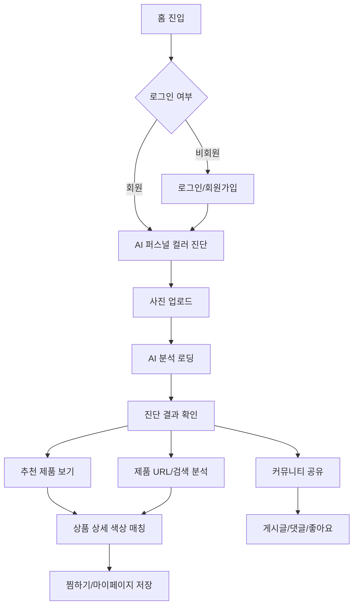

# Lumiere 스토리보드

## 1. 문서 개요

| 항목 | 내용 |
|---|---|
| 프로젝트명 | Lumiere |
| 서비스 정의 | AI 기반 퍼스널 컬러 진단 및 맞춤형 화장품 추천 서비스 |
| 주요 사용자 | 퍼스널 컬러를 알고 싶거나, 본인 톤에 맞는 화장품을 찾고 싶은 사용자 |
| 핵심 가치 | 사진 기반 진단, 제품 색상 분석, 맞춤 추천, 커뮤니티 공유를 하나의 흐름으로 제공 |
| 작성 기준 | 현재 Vue 프론트엔드 라우트와 Django REST API 구조 기준 |

## 2. 서비스 콘셉트

Lumiere는 사용자가 얼굴 이미지를 업로드하면 AI가 퍼스널 컬러를 진단하고, 진단 결과를 바탕으로 어울리는 화장품과 색상 옵션을 추천하는 웹 서비스이다. 사용자는 제품 URL이나 제품명을 통해 특정 상품의 색상 적합도를 분석할 수 있고, 커뮤니티에서 발색 리뷰와 추천 정보를 공유할 수 있다.

## 3. 핵심 사용자 여정

## 4. 전체 정보 구조

| 영역 | 주요 화면 | 라우트 | 목적 |
|---|---|---|---|
| 공통 | 헤더/내비게이션 | 전체 화면 | 주요 기능 이동, 로그인 상태 확인 |
| 홈 | 메인 | `/` | 서비스 소개, 진단/제품 분석/추천 진입 |
| 계정 | 로그인/회원가입 | `/login` | JWT 로그인, 회원가입, 비밀번호 찾기 |
| 진단 | 사진 업로드 | `/upload` | 진단용 이미지 선택 및 검사 전 안내 |
| 진단 | 분석 로딩 | `/loading` | 업로드 이미지 기반 AI 분석 진행 상태 표시 |
| 진단 | 결과 | `/result/:id?`, `/diagnosis/results/:diagnosisId` | 퍼스널 컬러 결과, 팔레트, 스타일 가이드 표시 |
| 제품 | 추천 제품 | `/products` | 톤 기준 추천 상품 목록과 필터 제공 |
| 제품 | 제품 색상 분석 | `/product-analysis` | 제품 URL 또는 검색 기반 색상 옵션 분석 |
| 제품 | 상세 매칭 | `/products/:id/color-matching`, `/product-detail/:id?` | 상품별 옵션 색상과 사용자 톤 비교 |
| 커뮤니티 | 목록/라운지 | `/community`, `/community/lounge/:loungeKey` | 게시글 탐색, 태그/톤 라운지 필터 |
| 커뮤니티 | 작성 | `/community/posts/new` | 게시글 작성, 상품 태그 연결 |
| 커뮤니티 | 상세 | `/community/posts/:id` | 게시글 본문, 댓글, 좋아요 |
| 마이페이지 | 요약/목록 | `/mypage`, `/mypage/*` | 진단 기록, 찜한 옵션, URL 분석 기록, 내 게시글 관리 |

## 5. 화면별 스토리보드

### SB-00. 공통 헤더

| 항목 | 내용 |
|---|---|
| 목적 | 사용자가 주요 기능으로 빠르게 이동할 수 있게 한다. |
| 진입 | 모든 주요 페이지 상단 |
| 주요 구성 | Lumiere 로고, 진단하기, 제품 분석, 추천 제품, 커뮤니티, 마이페이지, 로그인/사용자 메뉴 |
| 사용자 행동 | 메뉴 클릭, 마이페이지 진입, 로그인/로그아웃 |
| 시스템 반응 | 보호 라우트 접근 시 비로그인 사용자는 로그인 화면으로 이동 |
| 예외/상태 | 인증 토큰이 없으면 로그인 필요 메시지 표시 |

### SB-01. 홈 화면

| 항목 | 내용 |
|---|---|
| 라우트 | `/` |
| 목적 | 서비스의 핵심 기능을 소개하고 사용자를 진단 또는 제품 분석으로 유도한다. |
| 주요 구성 | 히어로 문구, AI 퍼스널컬러 진단 버튼, 제품 색상 분석 버튼, 내 퍼스널컬러 요약 카드, 핵심 기능 카드, 오늘의 인기 추천 제품 |
| 사용자 행동 | `AI 퍼스널컬러 진단하기`, `제품 색상 분석하기`, 추천 제품 상세 진입 |
| 시스템 반응 | 최신 진단 결과가 있으면 요약 카드에 톤명과 대표 팔레트 표시, 없으면 진단 유도 문구 표시 |
| 데이터/API | `GET /api/diagnosis/latest/`, `GET /api/products/` |
| 예외/상태 | API 실패 시 기본 추천 상품 데이터 표시 |

### SB-02. 로그인/회원가입 화면

| 항목 | 내용 |
|---|---|
| 라우트 | `/login` |
| 목적 | 사용자의 인증을 처리하고 진단, 작성, 마이페이지 기능을 사용할 수 있게 한다. |
| 주요 구성 | 로그인 폼, 회원가입 폼, 비밀번호 찾기 폼 |
| 사용자 행동 | 아이디/비밀번호 입력, 회원가입 정보 입력, 아이디/닉네임 중복 확인, 비밀번호 찾기 요청 |
| 시스템 반응 | 로그인 성공 시 JWT 토큰 저장 후 이전 페이지 또는 홈으로 이동 |
| 데이터/API | `POST /accounts/jwt-login/`, `POST /accounts/signup/`, `GET /accounts/check-username/`, `GET /accounts/check-nickname/`, `POST /accounts/find-password/` |
| 예외/상태 | 필수 입력 누락, 중복 아이디/닉네임, 인증 실패 메시지 표시 |

### SB-03. AI 퍼스널 컬러 진단 업로드

| 항목 | 내용 |
|---|---|
| 라우트 | `/upload` |
| 목적 | 정확한 진단을 위해 사진 업로드와 촬영 가이드를 제공한다. |
| 주요 구성 | 단계 표시, 촬영 가이드, 파일 선택 영역, 업로드 이미지 미리보기, 좋은/피해야 할 사진 조건, 분석 시작 버튼 |
| 사용자 행동 | JPG/PNG 이미지 선택, 미리보기 확인, 다른 사진으로 변경, 분석 시작 |
| 시스템 반응 | 파일 형식과 용량을 검증한 뒤 분석 로딩 화면으로 이동 |
| 데이터/API | 이 화면에서는 파일을 준비하고 `/loading`으로 전달 |
| 예외/상태 | 비로그인 사용자는 로그인 화면으로 이동, 10MB 초과 또는 미지원 파일 형식 오류 표시 |

### SB-04. AI 분석 로딩

| 항목 | 내용 |
|---|---|
| 라우트 | `/loading` |
| 목적 | 사용자가 분석 진행 상황을 이해하도록 단계형 로딩 경험을 제공한다. |
| 주요 구성 | 업로드 이미지 미리보기, 분석 스토리, 진행 단계, 로딩 상태 |
| 사용자 행동 | 결과 대기 |
| 시스템 반응 | 이미지 파일을 백엔드로 전송하고 분석 완료 시 결과 화면으로 이동 |
| 데이터/API | `POST /api/diagnosis/analyze/` |
| 예외/상태 | 분석 실패, 낮은 신뢰도, 네트워크 오류 시 재시도 또는 안내 메시지 표시 |

### SB-05. 퍼스널 컬러 결과

| 항목 | 내용 |
|---|---|
| 라우트 | `/result/:id?`, `/diagnosis/results/:diagnosisId`, `/diagnosis/result`, `/diagnosis/results/demo` |
| 목적 | AI 진단 결과를 사용자가 이해하기 쉬운 시각 자료와 추천 문장으로 제공한다. |
| 주요 구성 | 톤명, 신뢰도, 대표 컬러, 팔레트, 피부 밸런스 차트, 스타일 가이드, AI 메이크오버 갤러리, 추천 제품 이동 버튼 |
| 사용자 행동 | 결과 확인, 메인 진단으로 설정, 메이크오버 생성/재시도, 추천 제품 보기 |
| 시스템 반응 | 결과 ID에 맞는 진단 데이터를 불러오고 팔레트/차트를 렌더링 |
| 데이터/API | `GET /api/diagnosis/results/:id/`, `GET /api/diagnosis/latest/`, `POST /api/diagnosis/results/:id/set-primary/`, `POST /api/diagnosis/results/:id/makeovers/` |
| 예외/상태 | 결과 없음, 팔레트 준비 중, 메이크오버 실패/재시도 상태 표시 |

### SB-06. 제품 색상/호수 분석

| 항목 | 내용 |
|---|---|
| 라우트 | `/product-analysis` |
| 목적 | 올리브영 URL 또는 제품 검색을 통해 색상 옵션별 퍼스널 컬러 적합도를 분석한다. |
| 주요 구성 | 제품 검색 바, URL 분석 입력, 최근 분석 목록, 검색 결과 미리보기, 옵션 색상 차트, 추천 옵션 아코디언, 상세 분석 패널 |
| 사용자 행동 | 제품명 검색, URL 입력 분석, 검색 결과 선택, 최근 분석 다시 보기, 분석 기록 삭제 |
| 시스템 반응 | 제품 데이터 또는 URL 분석 결과를 불러오고 사용자의 메인 진단 톤과 비교 |
| 데이터/API | `GET /api/products/?q=`, `GET /api/products/:id/color-analysis/`, `POST /api/products/color-analysis/`, `GET /api/engagements/url-analyses/` |
| 예외/상태 | 메인 퍼스널컬러 미설정 시 기본 분석만 표시, 잘못된 URL 또는 분석 실패 메시지 표시 |

### SB-07. 추천 제품 목록

| 항목 | 내용 |
|---|---|
| 라우트 | `/products` |
| 목적 | 사용자의 진단 톤 또는 기본 기준 톤에 가까운 화장품을 카테고리별로 추천한다. |
| 주요 구성 | 추천 기준 카드, 카테고리 탭, 톤 분포 차트, 브랜드 팔레트 필터, 색감/제형 필터, 정렬, 상품 카드 그리드, 찜한 제품 보기 |
| 사용자 행동 | 카테고리 선택, 브랜드 선택, 필터 적용, 상품 클릭, 찜하기, 검색어 기반 목록 확인 |
| 시스템 반응 | 상품을 그룹화하고 대표 옵션 기준으로 정렬 및 차트 표시 |
| 데이터/API | `GET /api/products/`, `GET /api/diagnosis/latest/`, `POST /api/engagements/liked-options/toggle/` |
| 예외/상태 | 상품 로딩 중, 조건에 맞는 상품 없음, 로그인 전 찜하기 제한 처리 |

### SB-08. 상품 상세 색상 매칭

| 항목 | 내용 |
|---|---|
| 라우트 | `/products/:id/color-matching`, `/product-detail/:id?` |
| 목적 | 특정 상품의 색상 옵션을 사용자의 퍼스널 컬러 기준과 비교해 상세 분석한다. |
| 주요 구성 | 상품 이미지/브랜드/상품명, 옵션 선택, 매칭 점수 링, 레이더 차트, 색상 프로필, 옵션 분포 차트, 옵션별 적합도 순위, 상세 수치 비교, 유사 제품 추천 |
| 사용자 행동 | 옵션 전환, 기준 톤 변경, 유사 제품 이동, 찜하기 |
| 시스템 반응 | 선택 옵션에 맞춰 점수, 색상 차트, 추천 이유를 갱신 |
| 데이터/API | `GET /api/products/:id/`, `GET /api/products/:id/color-analysis/`, `POST /api/engagements/liked-options/toggle/` |
| 예외/상태 | 옵션 정보 없음, 상품 이미지 없음, 비로그인 찜하기 시 로그인 유도 |

### SB-09. 커뮤니티 목록/라운지

| 항목 | 내용 |
|---|---|
| 라우트 | `/community`, `/community/lounge/:loungeKey` |
| 목적 | 사용자가 톤별/주제별 게시글을 탐색하고 뷰티 정보를 공유할 수 있게 한다. |
| 주요 구성 | 카테고리 바, 선택 태그, 톤 라운지, 인기 태그, 게시글 리스트, 우측 사이드바, 글쓰기 버튼 |
| 사용자 행동 | 카테고리 선택, 태그 필터, 라운지 이동, 게시글 클릭, 글쓰기 진입 |
| 시스템 반응 | 카테고리/태그/라운지 조건에 맞춰 게시글 목록 표시 |
| 데이터/API | `GET /api/community/posts/` |
| 예외/상태 | 게시글 없음, 비로그인 글쓰기 접근 시 로그인 이동 |

### SB-10. 커뮤니티 게시글 작성

| 항목 | 내용 |
|---|---|
| 라우트 | `/community/posts/new` |
| 목적 | 사용자가 제품 경험, 발색 리뷰, 질문 등을 게시글로 작성한다. |
| 주요 구성 | 카테고리 선택, 제목 입력, 본문 입력, 이미지 업로드/URL, 상품 태그 선택, 등록 버튼 |
| 사용자 행동 | 글 작성, 상품 태그 연결, 등록 또는 취소 |
| 시스템 반응 | 등록 성공 시 게시글 상세 화면으로 이동 |
| 데이터/API | `POST /api/community/posts/`, `GET /api/products/?q=` |
| 예외/상태 | 비로그인 접근 제한, 필수 입력 누락, 등록 실패 메시지 |

### SB-11. 커뮤니티 상세

| 항목 | 내용 |
|---|---|
| 라우트 | `/community/posts/:id` |
| 목적 | 게시글 본문과 댓글 대화를 제공하고 커뮤니티 상호작용을 지원한다. |
| 주요 구성 | 게시글 제목/작성자/카테고리/본문/이미지, 태그 상품, 좋아요, 댓글 목록, 대댓글 입력 |
| 사용자 행동 | 좋아요, 댓글 작성, 대댓글 작성, 상품 상세 이동, 목록 복귀 |
| 시스템 반응 | 좋아요 수와 댓글 목록을 갱신 |
| 데이터/API | `GET /api/community/posts/:id/`, `POST /api/community/posts/:id/like/`, `GET /api/community/posts/:id/comments/`, `POST /api/community/posts/:id/comments/`, `POST /api/community/comments/:id/like/` |
| 예외/상태 | 삭제된 게시글, 댓글 작성 권한 없음, 네트워크 오류 |

### SB-12. 마이페이지

| 항목 | 내용 |
|---|---|
| 라우트 | `/mypage`, `/mypage/diagnoses`, `/mypage/liked-options`, `/mypage/url-analyses`, `/mypage/posts` |
| 목적 | 사용자의 진단 기록, 찜한 제품, URL 분석 기록, 작성 게시글, 프로필 정보를 관리한다. |
| 주요 구성 | 프로필 카드, 최근 진단 요약, 진단 목록, 찜한 옵션 목록, URL 분석 기록, 내 게시글 목록, 프로필 수정 모달 |
| 사용자 행동 | 프로필 수정, 진단 결과 상세 이동, 메인 진단 설정, 찜한 상품 확인, 분석 기록 삭제, 내 게시글 확인 |
| 시스템 반응 | 사용자별 저장 데이터를 조회하고 목록 유형에 따라 화면 갱신 |
| 데이터/API | `GET /accounts/user/`, `PATCH /accounts/user/update/`, `GET /api/diagnosis/results/`, `GET /api/engagements/liked-options/`, `GET /api/engagements/url-analyses/`, `GET /api/community/posts/mine/` |
| 예외/상태 | 비로그인 접근 제한, 프로필 저장 실패, 목록 없음 |

## 6. 주요 API 연동 요약

| 기능 | 메서드/경로 | 설명 |
|---|---|---|
| 로그인 | `POST /accounts/jwt-login/` | JWT access/refresh 토큰 발급 |
| 회원가입 | `POST /accounts/signup/` | 신규 사용자 생성 |
| 현재 사용자 | `GET /accounts/user/` | 로그인 사용자 정보 조회 |
| AI 진단 | `POST /api/diagnosis/analyze/` | 이미지 기반 퍼스널 컬러 진단 |
| 최신 진단 | `GET /api/diagnosis/latest/` | 사용자 메인/최신 진단 조회 |
| 진단 목록 | `GET /api/diagnosis/results/` | 사용자 진단 히스토리 조회 |
| 상품 목록 | `GET /api/products/` | 추천 제품 목록 조회 |
| 상품 상세 | `GET /api/products/:id/` | 상품 상세 정보 조회 |
| 상품 색상 분석 | `GET /api/products/:id/color-analysis/` | 저장 상품의 옵션 색상 분석 |
| URL 색상 분석 | `POST /api/products/color-analysis/` | 외부 상품 URL 기반 분석 |
| 찜 토글 | `POST /api/engagements/liked-options/toggle/` | 상품/옵션 찜 등록 또는 해제 |
| 분석 기록 | `GET /api/engagements/url-analyses/` | 사용자 URL 분석 기록 조회 |
| 커뮤니티 목록 | `GET /api/community/posts/` | 게시글 목록 조회 |
| 커뮤니티 작성 | `POST /api/community/posts/` | 게시글 작성 |
| 게시글 좋아요 | `POST /api/community/posts/:id/like/` | 게시글 좋아요 토글 |
| 댓글 | `GET/POST /api/community/posts/:id/comments/` | 댓글 조회/작성 |

## 7. 데이터 모델 연결 요약

| 도메인 | 주요 모델 | 역할 |
|---|---|---|
| 사용자 | `accounts.User` | 로그인 계정, 닉네임, 프로필 이미지, 권한 |
| 진단 | `diagnosis.DiagnosisResult` | 사용자별 퍼스널 컬러 결과, 신뢰도, 피부 지표, 스타일 가이드 |
| 진단 팔레트 | `DiagnosisRepresentativeColor`, `DiagnosisColorPalette` | 대표 색상과 베스트/워스트 팔레트 |
| 메이크오버 | `DiagnosisMakeoverStyle` | AI 메이크오버 스타일별 생성 상태와 이미지 |
| 상품 | `products.Product` | 네이버/카탈로그 상품 기본 정보와 색상 분석 값 |
| 상품 옵션 | `ProductOption`, `ProductOffer`, `ProductOptionToneScore` | 옵션별 색상, 판매처, 톤별 매칭 점수 |
| 참여 | `LikedProductOption`, `UrlAnalysisRecord` | 찜한 옵션, URL 분석 기록 |
| 커뮤니티 | `Post`, `Comment`, `PostLike`, `CommentLike` | 게시글, 댓글, 좋아요 |

## 8. 예외 및 빈 상태 설계

| 상황 | 화면 처리 |
|---|---|
| 비로그인 사용자가 보호 기능 접근 | 알림 표시 후 로그인 화면으로 이동, redirect query 유지 |
| 진단 이미지 형식 오류 | JPG/PNG만 가능하다는 오류 메시지 표시 |
| 진단 이미지 용량 초과 | 10MB 이하 이미지를 요청 |
| AI 진단 실패 | 재시도 또는 안내 메시지 표시 |
| 메인 퍼스널컬러 미설정 | 제품 분석 화면에서 개인화 추천 불가 안내 표시 |
| 상품 목록 로딩 실패 | 빈 목록 또는 fallback 데이터 표시 |
| 추천 조건 결과 없음 | 필터 초기화 버튼 제공 |
| URL 분석 실패 | 안전한 오류 문구로 URL 재확인 요청 |
| 커뮤니티 게시글 없음 | 빈 목록 안내와 글쓰기 유도 |
| 마이페이지 목록 없음 | 진단하기, 제품 분석하기, 커뮤니티 이동 등 다음 행동 제안 |

## 9. 제출용 핵심 시나리오

### 시나리오 A. AI 진단 후 추천 제품 확인

1. 사용자가 홈에서 `AI 퍼스널컬러 진단하기`를 클릭한다.
2. 로그인하지 않은 경우 로그인 화면으로 이동하고, 로그인 후 다시 진단 화면으로 복귀한다.
3. 사용자가 자연광 정면 사진을 업로드한다.
4. 시스템은 파일 형식과 용량을 확인한 뒤 AI 분석을 시작한다.
5. 분석 완료 후 퍼스널 컬러 결과 화면에 톤명, 대표 컬러, 피부 지표, 스타일 가이드를 표시한다.
6. 사용자가 `추천 제품 보기`를 클릭한다.
7. 시스템은 진단 결과의 톤 프로필을 기준으로 상품 목록과 색상 분포 차트를 표시한다.
8. 사용자는 필터와 브랜드 선택으로 제품을 좁히고 상세 매칭 화면으로 이동한다.

### 시나리오 B. 제품 URL 분석

1. 사용자가 홈 또는 헤더에서 `제품 분석`으로 이동한다.
2. 올리브영 상품 URL을 입력한다.
3. 시스템은 URL에서 상품명, 이미지, 색상 옵션 정보를 분석한다.
4. 메인 퍼스널컬러가 있으면 옵션별 추천 점수와 이유를 표시한다.
5. 사용자는 차트에서 옵션을 선택하고 상세 색상 수치를 비교한다.
6. 분석 결과는 최근 분석 기록에 저장되어 마이페이지 또는 제품 분석 화면에서 다시 확인할 수 있다.

### 시나리오 C. 커뮤니티 공유

1. 사용자가 추천 제품 또는 진단 결과를 확인한 뒤 커뮤니티로 이동한다.
2. 카테고리와 톤 라운지를 선택해 유사한 사용자들의 게시글을 탐색한다.
3. 글쓰기 버튼을 누르고 제품 태그와 함께 리뷰를 작성한다.
4. 다른 사용자는 게시글 상세에서 댓글과 좋아요로 상호작용한다.

## 10. 화면 우선순위

| 우선순위 | 화면 | 이유 |
|---|---|---|
| 1 | AI 진단 업로드, 분석 로딩, 결과 | 서비스의 핵심 가치인 퍼스널 컬러 진단 흐름 |
| 2 | 추천 제품, 상품 상세 매칭 | 진단 결과가 실제 제품 추천으로 이어지는 핵심 전환 |
| 3 | 제품 URL 분석 | 사용자가 보유하거나 관심 있는 상품을 직접 분석하는 차별 기능 |
| 4 | 마이페이지 | 사용자 기록 저장과 재방문 동기 |
| 5 | 커뮤니티 | 사용자 간 공유와 서비스 체류 시간 확대 |
| 6 | 홈/계정 | 서비스 진입과 인증을 담당하는 기반 화면 |

## 11. 발표용 한 줄 정리

Lumiere는 `진단하기 → 결과 보기 → 제품 추천/분석 → 기록 저장/커뮤니티 공유`로 이어지는 개인 맞춤형 뷰티 추천 서비스이며, AI 진단 결과를 실제 화장품 선택 행동까지 연결하는 것을 목표로 한다.
